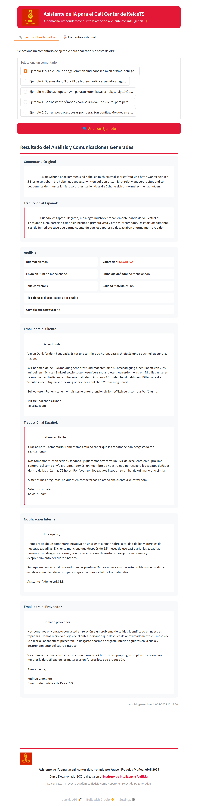
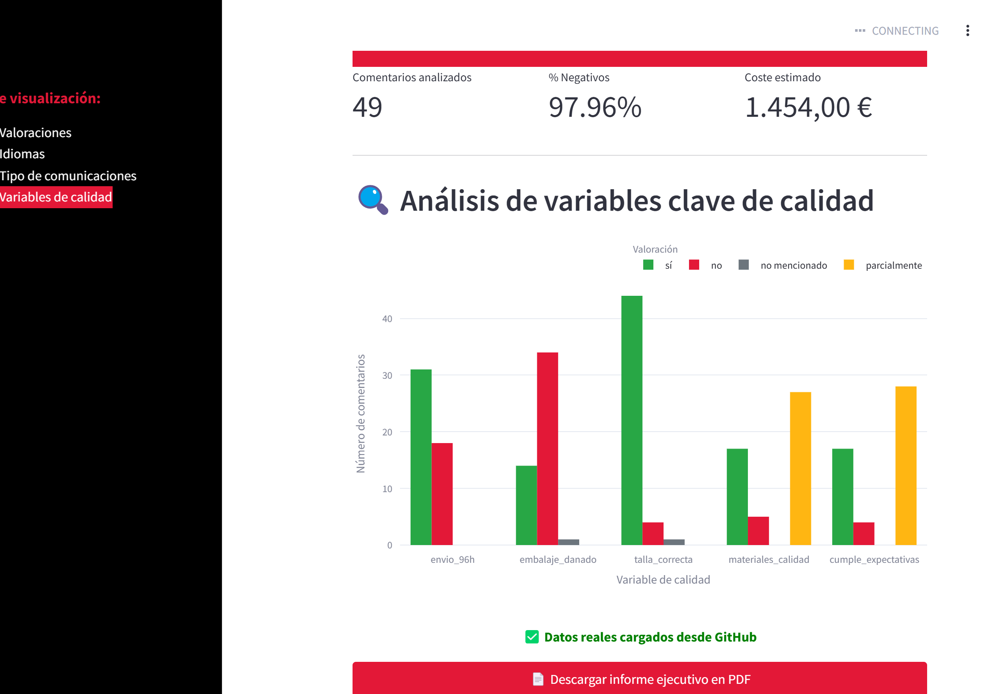

# 🚀 Capstone Project Curso Desarrolador 10x de Instituto de Inteligencia Artificial - Araceli Fradejas Muñoz - Abril 2025

*Análisis Automatizado de Comentarios de Clientes, App para agentes de Call Cnter y Dashboard Estratégico para CEO y ejecutivos de la startup ficticia "KELCE TS S.L."*  
**Curso:** Desarrollador 10X – Instituto de Inteligencia Artificial  
**Autora:** Araceli Fradejas Muñoz  
**Fecha:** Abril 2025  

---

## 📑 Tabla de Contenidos
- [Descripción General](#descripción-general)
- [Entregables](#entregables)
- [Instalación Rápida](#instalación-rápida)
- [Cómo Ejecutar](#cómo-ejecutar)
- [Capturas](#capturas)
- [Roadmap](#roadmap)
- [Créditos](#créditos)
- [ENGLISH VERSION](#english-version)

---

## Descripción General
KelceTS S.L. es una *startup* ficticia que vende zapatillas online en Europa.  
Durante el proyecto se desarrolló una **suite de IA generativa** que automatiza el
análisis de comentarios multilingües y presenta la información tanto a agentes operativos
como a la dirección.

---

## Entregables
| Nº | Producto | Tecnologías | Descripción |
|----|----------|-------------|-------------|
| **1** | ⚙️ *Notebook* de Análisis y Exportación (`Capstone_Project.ipynb`) | Python · OpenAI · Gemini · Pandas · Plotly | Analiza comentarios, aplica reglas de negocio y genera `Informe_Final_KelceTS.xlsx` |
| **2** | 💬 Asistente IA para Call‑Center (`Gradio_CallCenter_KelceTS.ipynb`) | Python · Gradio · LangDetect | Interface web para agentes que detecta idioma, traduce, analiza y genera comunicaciones |
| **3** | 📊 Dashboard Dirección (`app.py`) | Python · Streamlit · Plotly · ReportLab | Visualiza KPIs clave, costes y genera informes PDF ejecutivos |

---

## Instalación Rápida
```bash
git clone https://github.com/AraceliFradejas/kelcets-dashboard.git
cd kelcets-dashboard
pip install -r requirements.txt
# Configurar claves (opcional)
echo "OPENAI_API_KEY=TU_CLAVE" >> .env
echo "GOOGLE_API_KEY=TU_CLAVE" >> .env
```

---

## Cómo Ejecutar
| Entregable | Comando / Acción |
|------------|------------------|
| **E1** Notebook | Abrir en Colab  y seguir celdas |
| **E2** Gradio | Abrir `Gradio_CallCenter_KelceTS.ipynb` en Colab y ejecutar |
| **E3** Dashboard | `streamlit run app.py` |

---

## Capturas
<p align="center">
  
  
</p>

---

## Roadmap
- [ ] Clasificación emocional y tono  
- [ ] Soporte multimodal (imágenes, vídeos)  
- [ ] API REST para integración con CRM  
- [ ] Despliegue en Streamlit Cloud / Hugging Face  

---

## Créditos
Creado por **Araceli Fradejas Muñoz**   
Proyecto desarrollado por **Araceli Fradejas Muñoz** como parte del I Curso Intensivo de Desarrollador 10x con IA – Instituto de Inteligencia Artificial*.  
Contacto: [LinkedIn](https://www.linkedin.com/in/araceli-fradejas-munoz-transformaciondigital/)
Abril 2025

---

# ENGLISH VERSION

## Overview
KelceTS S.L. is a fictional online sneaker company.  
This repository contains a **Generative AI solution** that automates multilingual
feedback analysis and provides both operational and executive interfaces.

## Deliverables
| # | Product | Tech | Description |
|---|---------|------|-------------|
| **1** | ⚙️ Analysis Notebook (`Capstone_Project.ipynb`) | Python · OpenAI · Gemini · Pandas · Plotly | Processes comments, applies business rules and exports `Informe_Final_KelceTS.xlsx` |
| **2** | 💬 AI Assistant for Call Center (`Gradio_CallCenter_KelceTS.ipynb`) | Python · Gradio · LangDetect | Web UI for agents: language detection, translation, analysis and message generation |
| **3** | 📊 Executive Dashboard (`app.py`) | Python · Streamlit · Plotly · ReportLab | Displays key KPIs, cost estimates and generates executive PDF reports |

## Quick Start
```bash
git clone https://github.com/AraceliFradejas/kelcets-dashboard.git
cd kelcets-dashboard
pip install -r requirements.txt
# API keys (optional)
echo "OPENAI_API_KEY=YOUR_KEY" >> .env
echo "GOOGLE_API_KEY=YOUR_KEY" >> .env
```

## Run
| Deliverable | Command |
|-------------|---------|
| **D1** Notebook | Open in Colab  |
| **D2** Gradio | Open `Gradio_CallCenter_KelceTS.ipynb` in Colab |
| **D3** Dashboard | `streamlit run app.py` |

## Screenshots
See `/data` folder for previews.

## Roadmap
- Emotion & tone classification  
- Multimodal support  
- REST API for CRM integration  
- Deployment to Streamlit Cloud / Hugging Face  

### 👩‍💻 Author
Created by **Araceli Fradejas Muñoz**   
Desarrollador10X Course - Instituto de Inteligencia Artificial  
Contact: [LinkedIn](https://www.linkedin.com/in/araceli-fradejas-munoz-transformaciondigital/)
April 2025
